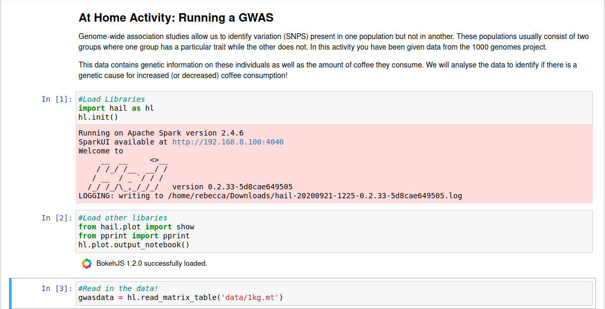
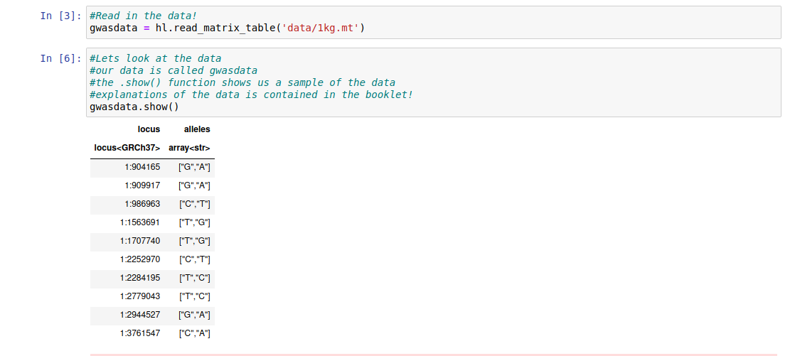
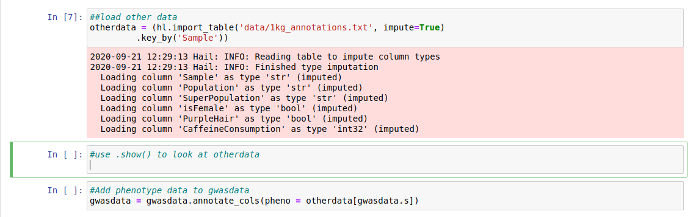
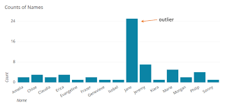
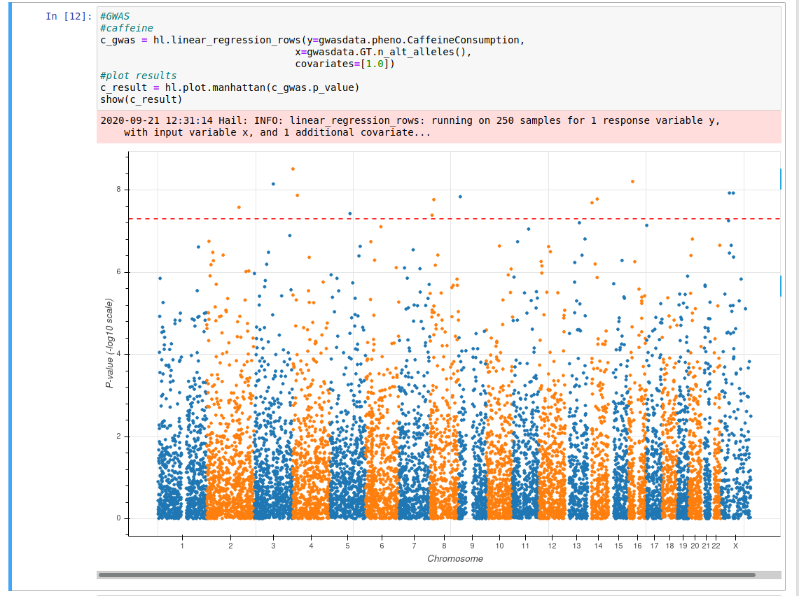

Today we looked at:

- Variation in a population

- SNPs

- Alleles

- SNPs and their effect on traits

- GWAS

Information on these topics is available in the video and at the following website : https://youth-academy-dna.github.io/

  

## At Home Activity 1: Population Genomics Quiz 

1. What is population genomics (in your own words)?

   

2. What is a SNP?

   

3. What is the difference between a SNP and a mutation?

   

4. What is the name given to a commonly used method in population genomics?

   

## At Home Activity 2: Genome-Wide Association Study (GWAS) 

Genome-wide association studies allow us to identify variation (SNPS) present in one population but not in another. These populations usually consist of two groups where one group has a particular trait while the other does not. In this activity you have been given data from the 1000 genomes project.

This data contains genetic information on these individuals as well as the amount of coffee they consume. We will analyse the data to identify if there is a genetic cause for increased (or decreased) coffee consumption and purple hair!

This practical will be run on a jupyter notebook at the following link https://mybinder.org/v2/gh/YouthAcademy-DNA/week2/HEAD?labpath=Day2.ipynb. Follow the instructions from yesterday but using the updated link to launch it.
This may take a while! Don't forget to answer the questions as you go.


**Note:** This activity generates and uses a lot of data!! Sometimes this can cause notebooks to crash, if this happens you can restart by clicking the kernel option at the top of the page and clicking "Restart Kernel".   Otherwise you can try reloading it using the above link again. You may have to reload the data.

### Step 1: Loading the Libraries and the Data 


A library is a set of prewritten code which allows to do to complicated steps without writing the code ourselves. The code to load the libraries is already written for you. Remember in order to run code you click on the cell and either click "run" or press CTRL and Enter together. The code to load the data is also written for you, run this too.




### Step 2: Exploring our Data 

It is very important to explore data so that we can understand it.

We can see the start of the data by using the .show() function:

```{python}
gwasdata.show()
```


The following columns are of interest:

-   Locus: This shows the chromosome and then the position of the base

-   Allele: This shows the two possible bases at this position, the first one is the reference (most common) while the second is the alternate (less common).




**Question 1:** At position 1:1707740 what are the possible alleles? Can you guess which
chromosome it is on?


So far we have loaded genetic data about our population but we also need to know other information about them such as:

-   Male or Female

-   Population/Country

-   Phenotype information

Load the new data using the code written for you. Each row contains information about one individual.
Now use the .show() function as above to look at it.

```{python}
otherdata.show()
```




**Question 2:** What populations can you see?


**Question 3:** What are the two phenotypes we will look at?


We need to combine the two datasets. Run the next block to do this.

### Step 3: Quality Control

Now we know a bit about our data we need make sure that it is of good quality. Why is it important to have good quality data? Well, in the area of computer science there is a saying known as "Garbage In,
Garbage Out". This means that if the data you use in an analysis or experiment is bad, your results and conclusions will also be bad and unreliable.

Things that can affect the quality of data include:

-   Missing data entries

-   Data that has been entered more than once (duplicates)

-   Incorrect data

Luckily our data has been previously corrected for these issues. However, sometimes datasets contain data entries that are not like all the other entries. Look at the graph below, it contains a bar chart to record the number of each name of a pupil in a class.

We can see immediately that there are more Jane's than any other name. This data is therefore very different to the other data and could indicate incorrect data so we often remove this data to make results
more reliable.


Run the code in the next block, it will show you a graph which will mark
the outliers in red. 

**Question 4:** Are there any outliers? If you think there are outliers, run the next block to remove them.


**Question 5:** How many individuals/samples have you removed?


### Step 4: GWAS! 

Now we can finally investigate caffeine consumption and purple hair. The code shown in the picture below will run the GWAS, it takes all the SNPs for each individual and the phenotype of caffeine consumption and outputs a Manhattan plot.


If the plot contains an orange line with blue dots above it we can say that there is a genetic link to caffeine(coffee/tea) consumption. Run the code now.

**Question 6:** Is there a genetic link for caffeine consumption?


**Question 7:** Each dot above the line is a SNP, roughly how many SNPs are related to this trait?


Now run the code again replacing gwasdata.pheno.CaffeineConsumption with
gwasdata.pheno.PurpleHair.

**Question 8:** Are there any SNPs associated with purple hair? If so, how many? If not,
why do you think this is?


## Zoom Tutorial Activity: PheWAS 

Thousands of GWAS have been run in order to investigate different traits. Some databases have information on lots of behavioural traits such as the type of milk or chocolate you like, how many sweets you eat or even whether you like cucumbers! 

We have already linked SNPs to a trait but we can also investigate SNPs to see if they affect any other traits. In this activity we will take a SNPs related to the traits mentioned above and see which other traits are affected by it. This type of analysis is known as a PheWAS.


\

\

\

\
