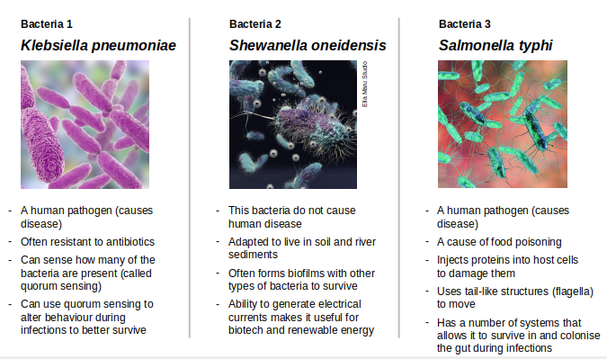
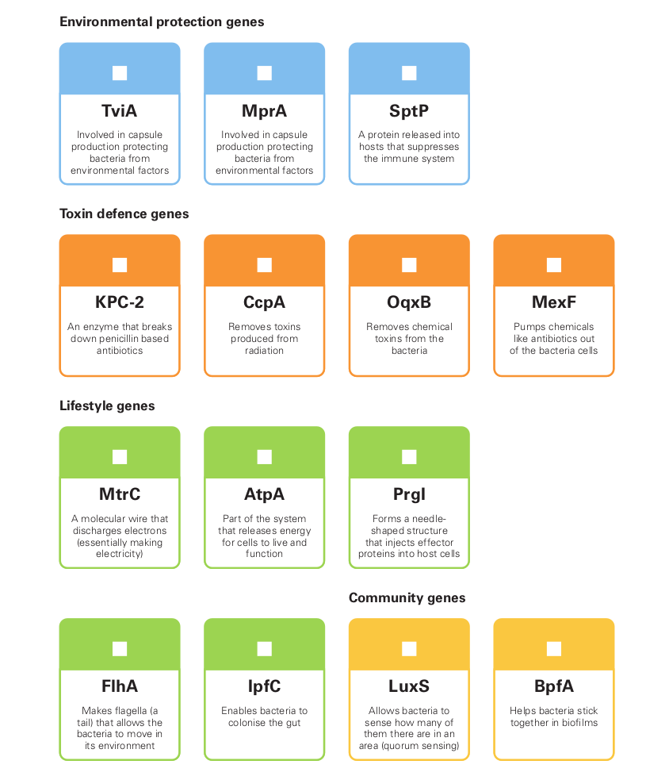
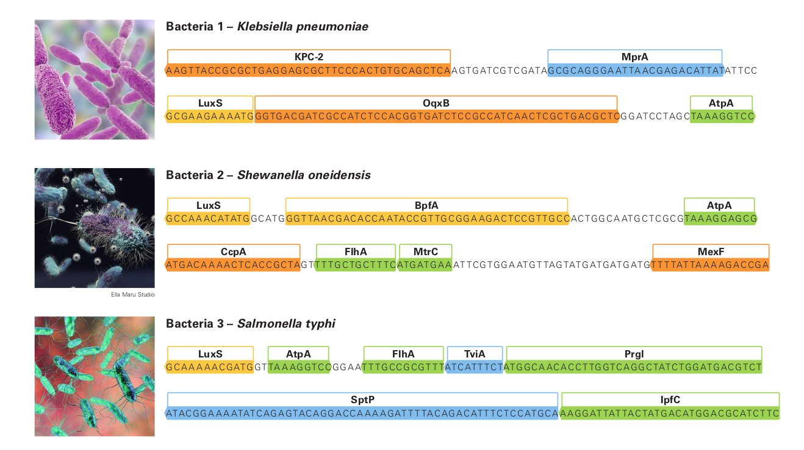

Today we looked at:

-   Genomes of different species
-   Aligning genomes
-   Why we compare genomes
-   Phylogenetic trees

Information on these topics is available in the video and at the following website : https://youth-academy-dna.github.io/

## At Home Activity 1: Comparative Genomics Quiz 

1. What is meant by comparative genomics?

   

2. What process is used to compare genomes?

   

3. How can we show the relationships between genomes of different species?

   

4. Write down two animals that closely resemble each other or carry out similar activities (eg different types of birds fly, different types of fish swim) Write down two things they have in common and two things they do differently. Do you think either of these two things are due to genes?

   

## At Home Activity Two: Comparing Bacterial Sequences 

Bacteria are tiny living things that can be beneficial and help us break down food for digestion or in some cases cause infection. This activity will allow you to compare sequences and genes of three bacterial
species.[^1]

1. Below is the description of three different types of bacteria two of which can make you sick and one that cannot. Read the description of each.
   

2. The next picture shows the genes present in these bacteria along with a short description. The genes help them live in their environment, defend against danger, function normally and genes that help them live in groups.
    

3. Finally we can see the genomes of the bacteria and the genes they contain.
   

4. Now we have studied our data, think about the following questions:

   a. Both bacteria 1 and bacteria 3 cause disease. Which genes do you think help them do this and why? Do they share the same genes that help them make people sick?
   

   

   

   

   b. Certain genes help the bacteria live in and adapt their environment. For each bacteria pick a gene that you think helps it adapt to its environment. Given the information you have about the bacteria why do you think it has this particular gene?

   

   

   

   c. Some genes are older than others which means all species should have it, which gene(s) do you think is the oldest? Why?

   

   

   

   d. Now that you have compared the genomes which species do you think are most closely related? (The two most closely related should have the most genes in common.) Draw a diagram to show the relationship between the three.

## Zoom Tutorial Activity: Alignment and Tree Construction 

Together we will use python to align the bacterial genomes and construct a phylogenetic tree. The activity will be available at the following link during the class: https://mybinder.org/v2/gh/Youth-Academy-DNA/week4/HEAD?labpath=Day3.ipynb

