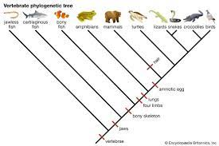

# Comparative Genomics
- "Compares" genomes of different animals, bacteria, viruses etc..

- We are all connected by our genes no matter how distantly!

- Our genetic code and size can be very different! 

## What genomes have been sequenced?
- Mouse: 2002

- Human: Human Genome Project – 2003

- Rat: 2004

- Chimp: 2005

- Bee: 2006

## How do we compare genomes?
- Alignment
- We ALIGN them by arranging them beside each other to look at similar sections

## Why do we want to compare genomes?

- Look for relationships between species
- Investigate the funcntions of genes
- Find genes that allow animals to adapt to their environment
- The amount of similarity of our genomes differs between species

## We can represent the relationships between species using phylogenetic trees

