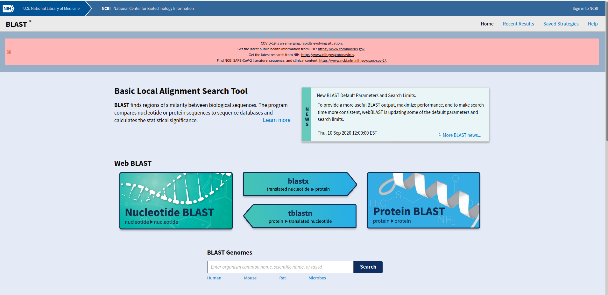

Today we looked at:

-   Ancient humans
-   Neanderthals
-   Denisovans
-   How are ancestors have helped us survive today

Information on these topics is available in the video and at the following website : https://youth-academy-dna.github.io/

## At Home Activity 1: Ancient Genomics Quiz 

1. Name the two ancient humans mentioned.

   

   

2. How much of our DNA is shared with Neanderthals?

   

   

3. How do we study ancient DNA?

   

   

4. What ancient human was only recently discovered? How?

   

   

5. Why do you think Tibetans need a special variant in EPAS1? (Hint: the mountain in the video is very famous and near Tibet)

## At Home Activity 2: Finding Living Relatives of the T-Rex

The T-Rex is a dinosaur that went extinct around 65 million years ago. We will use T-Rex protein found in fossils to investigate which animal is most similar to it. To do this we will use a tool called BLAST to
compare it to other sequences in the database. We will use protein sequence instead of DNA sequence as this is not available. Remember proteins are made using the instructions of DNA so while the letters are
different they originally were just DNA bases.

1. This is the protein sequence for the T-Rex for collagen. Collagen is a structural protein which helps keep bone and skin intact.

GLPGESGAVGPAGPIGSR

2. The picture below is of the BLAST homepage. Use this link to get there. https://blast.ncbi.nlm.nih.gov/Blast.cgi. BLAST will compare the sequence above to other proteins in the database.

   

   

3. On the homepage click protein BLAST. You should now see a form like the one below. Enter the following information: At the "Enter Query Sequence" box paste the following: (You can also copy it from the website page for Week 5: https://youth-academy-dna.github.io/) 

GLPGESGAVGPAGPIGSR

- At "Job Title" write TRex
- Choose SwissProt from the "Database" menu
- Under the Blast button click the " + Algorithm Parameters" button
- Using the dropdown menu change the "Max target sequences" to 10
- Click "Blast"!

4. Once the results appear scroll down to the "descriptions". This is a list of similar proteins, the animal that has that similar protein is listed in the square brackets. These will be scientific names so you may
   have to google them to get the commonly used name.

- Write down the name of 5 animals that share a similar protein.

  

  

- Check the percent identity for each animal you wrote down and write this down too.

  

  

- The higher the percent the more similar the protein is. Which of the animals you selected is the most similar?

  

5. BLAST also tells us about E values, this is the chance that the similar protein is not similar to ours. Click on the "E Value" label at the top of the table. This will sort them, scroll to the very bottom of the table to the last entry. This is the animal least likely to be similar. Which animal is it?

   

   

6. At the top of the page click "Distance Tree of Results". This will give you a phylogenetic tree. The T-Rex will be highlighted in yellow. The animal above is its closest dinosaur relative. What is it?

   

   

7. The animal below the T-Rex is the closest living relative. What is it and are you surprised by this?

   

   

## Zoom Tutorial Activity: Phylogenetic Tree of Human Populations

We will use python to create a tree to show how modern populations are all related to each other. We will use the notebook at this link:
https://mybinder.org/v2/gh/Youth-Academy-DNA/week5/HEAD?labpath=Day4.ipynb

