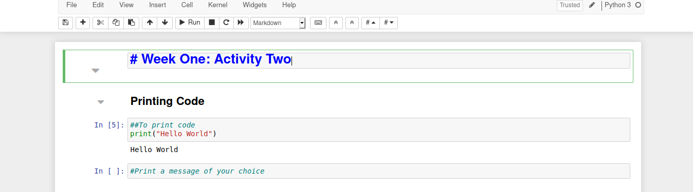
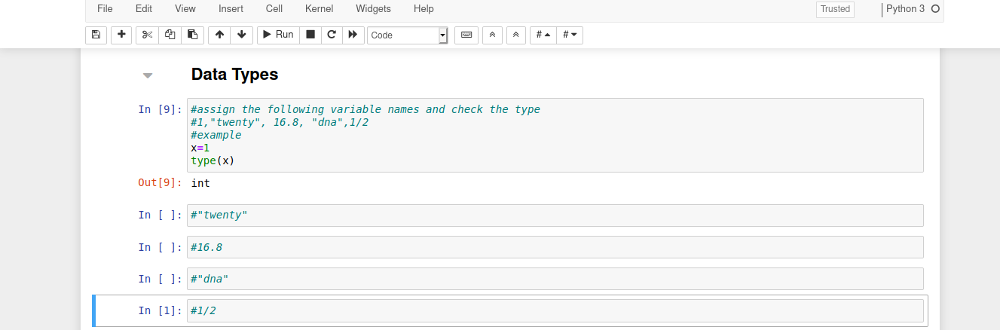
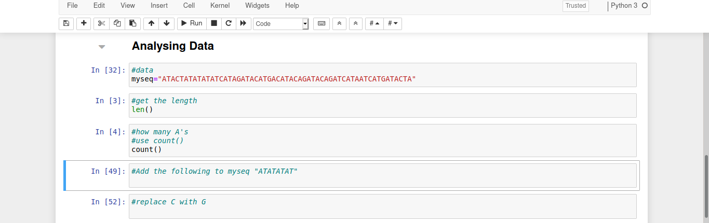

## At Home Activity 1: Genetics and Genomics Worksheet 

Based on the material discussed in the online lecture answer the following questions:

1. What is a) Genetics, b) Genomics\

   \

   \

2. What substance contains our genetic code?\

   \

3. Name the four bases and their partners.\

   \

4. What term is given to the many instructions contained within the DNA?\

   \

5. What is mutation?\

   \

6. Based on what you have learned, give 2 examples of physical characteristics not mentioned in the lecture that you think DNA has an impact on.\

   \

7. What is sequencing?\

   \

8. Why would we want to use computer programming?\

   \

## At Home Activity 2: Introduction to Python

Computer programming languages are often used to solve problems and analyse data in genomics. Python is a programming language which is widely used in both computer science and biology as is it extremely versatile. In this activity we will learn some core concepts that will enable us to use Python during this course.

In order to run Python code online we will use a tool called Binder which allows us to run notebooks which execute code. The following is a set of instructions to launch a notebook and will also be needed in later weeks. A video demonstration will be provided.


***Launching A Notebook***

-   In the your browser type (This may take a minute):
    https://mybinder.org/v2/gh/Youth-Academy-DNA/week1a/HEAD

-   When the page loads, click on 'help'

-   Click \"launch classic notebook\"

-   Click on activity2.ipynb to open it

-   You will now see a page with multiple \"Blocks\"

-   Each block contains code which can be run by pressing CTRL and Enter
    OR by clicking the run button

-   To write non-code (comments) in the blocks, put a \# before the text

This is what a jupyter notebook looks like!\




### Python Basics 

To begin we will look at the following:

-   Printing code

-   Variables

-   Data Types

-   Reading in data

-   Functions


*Printing Code*

 Let's print the classic programming example \"Hello World\" to the screen using the function print():

```{python}
print("Hello World") 
```

Now try printing a message of your choice! Note you can use single or double quotes but you cannot mix them, see what happens if you do.\


*Variables*

When we need to store information so that we can use it later we give it a name known as a variable. For example if we have a sequence of DNA we call it mydna and label it as such.

```{python}
mydna="ATAC"
```


Now print your variable, note you do not use quotes when referring to a variable.

```{python}
print(mydna)
```


Try combining the variable mydna and the phrase \"My sequence is:" within a print statement to give the result: My sequence is: ATAC

*Data Types*

Data in python can be of several different types. We have already come across one type: strings which are made up of characters contained within quotes. Some other types of data are contained below.

-   Numbers: numbers can be integers (whole numbers) or floats (numbers
    which have a decimal point).

-   Strings: Characters contained within quotes

You can check what type of data a variable is by using the function type().

Assign variable names to the following values and check their type:
1,\"twenty\", 16.8, \"dna\", 1/2\

For example:

```{python}
x=1
type(x)
```

\




*Manipulating Data*

As sequence data is text we will concentrate on using Python to analyse text-based data.

In your notebook a sequence has been labelled myseq. It is a piece of DNA from a real strain of the flu virus but we do not know which strain it is. 

Lets find the length of our sequence using the function len() as shown below. How many letters are in myseq?

```{python}
len(myseq)
```


What if we want to find how many of each letter is there?
We can use count(), to find the number of A's. How many are there?

```{python}
myseq.count("A")
```


Do this for each letter and write down how many of each you find.

If some of our data is missing we might want to add to the sequence:

```{python}
mynewseq=myseq+"ATATATAT"
```

\



Now we know some important information about our flu strain. We will investigate it further in the zoom tutorial to find out which strain it is! 


## Zoom Tutorial Activity:  Using Python To Study Flu Viruses 


In this activity we will use the following notebook: https://mybinder.org/v2/gh/Youth-Academy-DNA/week1zoom/HEAD  

Together we will look at the code that you learned in the previous activity and compare it to known sequences to see what strain of the flu a person has!
