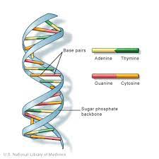
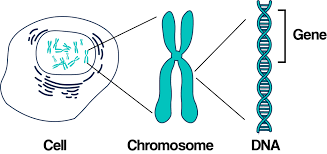
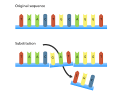
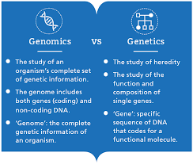
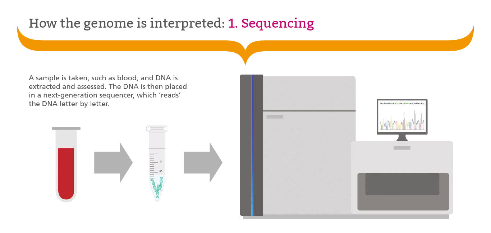
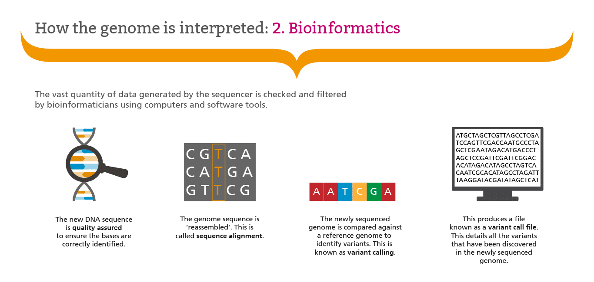

# Introduction to Genetics and Genomics

This course will:

- Last 6 weeks
- Consist of 3 parts

  - Weekly online video

  - At-home activities

  - Weekly Zoom tutorial on Saturday
- Each week will tackle a new area of genomics

## What is DNA?

- **D**eoxyribo**N**ucleic **A**cid
- Carries genetic instructions/code
  - Genes
- Double Stranded helix

## Genes

- Sections of DNA along chromosomes
- Carry information
- Determine characteristics
  - Height
  - Hair colour etc.\

## Mutations

Mutations are changes in the DNA sequence.\

\

The four bases can differ between people and can lead to differences in physical characteristics.

\

## Genetics, Genomics and DNA

## Our Genome Is Isolated Using Sequencing

- DNA sequencing can determine the nucleotide composition of DNA

\

## Data Science Can Be Used to Analyse Sequencing Results

Our genetic code is made up of 3 billion letters. As this is an extremely large number it is difficult to analyse without the help of:

- Data Science
- Computer Programing
- Statistics

These can be used to 

- Process, Model and Explore data
- Identify trends/patterns

