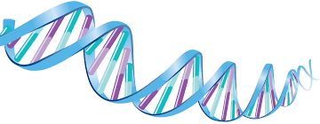

This website was created to host materials for the NUI Galway Youth Academy course, "DNA The Data inside Us".\
\
This is a 5 day course which will tackle a new area of genetics and genomics each day.\
\
These topics include
- Introduction to Genetics and Genomics
- Population Genomics
- Transcriptomics
- Comparative Genomics
- Ancient  Genomics
- Machine Learning in Genomics\
&nbsp;&nbsp;&nbsp;&nbsp;&nbsp;&nbsp;&nbsp;&nbsp;&nbsp;&nbsp;&nbsp;&nbsp;&nbsp;&nbsp;&nbsp;&nbsp;&nbsp;&nbsp;&nbsp;&nbsp;&nbsp;&nbsp;&nbsp;&nbsp;&nbsp;&nbsp;&nbsp;&nbsp;&nbsp;&nbsp;&nbsp;&nbsp;&nbsp;&nbsp;&nbsp;&nbsp;&nbsp;&nbsp;&nbsp;&nbsp;&nbsp;&nbsp;&nbsp;&nbsp;&nbsp;&nbsp;&nbsp;&nbsp;&nbsp; 
